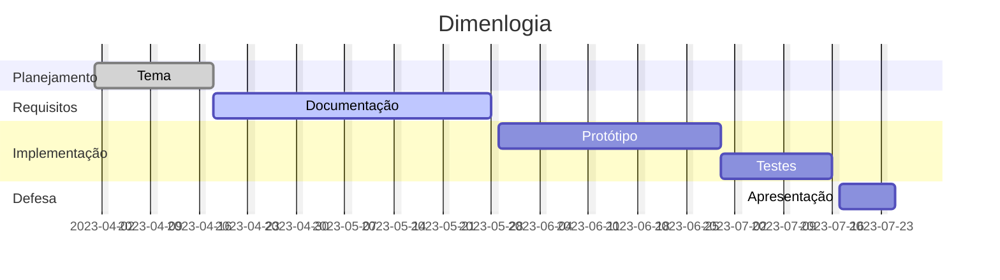

# projeto-integrador-2

### Cronograma de atividades - gantt

* Projeto integrador II

## Cronograma de atividades

## Planejamento - 01-04-2023 a 15-04-2023

### Tema

Escolha do tema através dos conhecimentos das necessidades cotidianas, inovações e brainstorming com os colegas de classe.

## Requisitos - 15-04-2023 a 20-05-2023

### Documentação

Definidos os requisitos dos projetos pensando nos problemas a serem solucionados.

A escolha das tecnologias que serão usadas no desenvolvimento do software

Escolher os autores para a base bibliográfica e a construção da fundamentação teórica.

## Implantação - 20-05-2023 a 04-07-2023

### Protótipo

A criação do primeiro protótipo da aplicação.

## Testes

Execução dos testes com a aplicação.

## Defesa  - 04-07-2023 a 11-07-2023

### Apresentação

Apresentação do projeto integrador e/ou tcc para banca de examinadores de TSI/IFRN.

### Integração com as disciplinas

O sistema dimenlogia será uma aplicação mobile com as tecnologias Ionic + Angular + NodeJs + MySQL + Jasmine. Para a criação do Front-End, a opção de usar o Ionic + Angular se dá ao uso desse framework na disciplina de Desenvolvimento Móvel, pois é uma framework que trabalha com SPA (Single Page Application), que separa cada parte do código em componentes, modelo muito utilizado no desenvolvimento de sistemas mais atuais e que facilita na manutenção do código e na separação por tipo de script (estilo, marcação e lógica) e o a facilidade da geração do app android com o Ionic.

O NodeJs foi amplamente utilizado nas disciplinas de Desenvolvimento Back-End e por isso ficaria mais viável sua aplicação nesse projeto devido a familiaridade com o mercado e de nós desenvolvedores. Existem muitas bibliotecas e diversos exemplos prontos para facilitar o desenvolvimento.

O MySQL, que faz parte das disciplinas de Programação para banco de dados e bancos de dados. Não só no uso desse SGBD, mas durante a modelação do cenário. Nas disciplinas de front e back foi feita a criação das classe e seus objetos para a montagem dos sistemas de cada projeto.

Por último, o Jasmine já vem por padrão no Angular assim que um novo projeto é criado e pode ser implementado de forma simples. Isso facilitara na testagem da aplicação assim como o uso da metodologia de testes unitários e TDD(Test-Driven Development).
